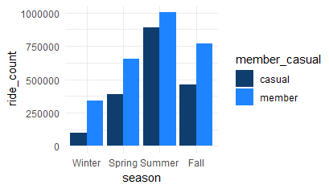
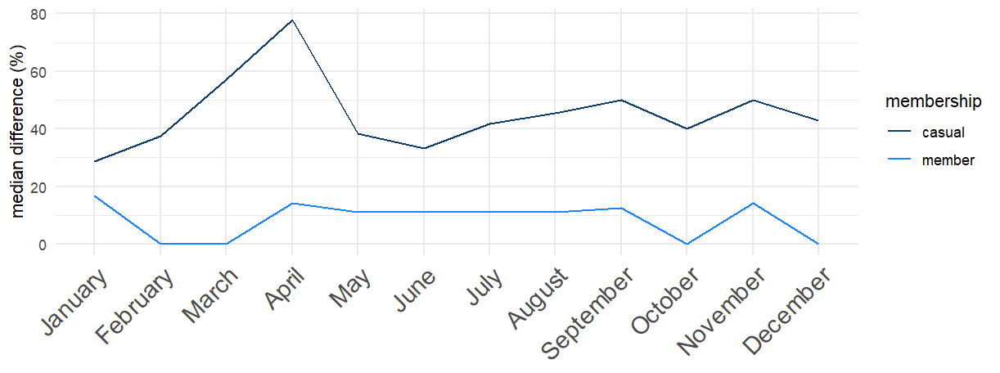

DivvyBikeSharing
======

[Divvy](https://en.wikipedia.org/wiki/Divvy) is a bike sharing system in
Chicago recently acquired and owned by Lyft, Inc.  

*Management Decision Problem (MDP):* Let’s convert casual riders to members

*The Market research question (MRQ):* How do they each use Divvy?

We'll be using 12 months of ride data (MAY 2022 - APR 2023) published [here](https://divvybikes.com/system-data).  

  
-------
### Cleaning  
All cleaning was done in BigQuery SQL.

 *__NOTE__ Only more complex queries are displayed here. For the rest, please see [here](Divvy/Divvy.sql).*  


Some basic things that I did are:

|  Operation | Why  |
|---|---|
| 1. Duplicate check  |   |
| 2. Docked bikes were converted to Classic | [Someone said](https://medium.com/@iainselliott/google-data-analytics-capstone-project-cyclistic-case-study-8baed2f5a286) that classic and docked bikes are the same so I pretended that my hypothetical boss confirmed this and converted all to classic.  |
| 3. Rides with irrelevant stations were removed  | The same person had a [list](https://github.com/iainelli/Capstone-Project-Cyclistic-Case-Study/blob/main/data_cleaning_analysis.sql)  of stations that were service stations for the bikes and not public. I checked the rows with these and the amount of missing data in those rows convinced me that this was true; again, in real life I would confirm with my boss, which I will pretend I did for now.    |
|4. Ride length was computed from the timestamps|For calculations|
|  5. Rides under 1 minute and over 24 hours were removed | Rides start from 1 minute, and anything longer than 24 is considered stolen or missing. <br/> If anyonne cancelled their rides in less than one minute, it doesn't add any value to our research of ride trends. If we wish to explore the cancel rates then we can do that later. <br/> Missing bike trends may also be addressed in future projects|
| 6. Missing station names and ids were filled using self joins based off of latitude and longitude data |  |
| 7. The two remainders from 6 were investigated and left as is | There was an [event](https://blockclubchicago.org/2022/07/14/the-silver-room-block-party-is-back-this-weekend-heres-how-to-go-in-style/) during the dates when Oakwood Beach Valet are recorded, and there was a [house sale](https://www.redfin.com/IL/Chicago/2437-W-Cortez-St-60622/unit-1/home/18914666) during the dates that 410 was recorded. |
| 8. Duplicates created in the process were removed. | Operation 6 created duplicates from using LEFT JOIN with un-unique lat_lng values |
| 9. Electric bikes with no start_station_name were inserted with "bike_lock" | We have already removed stolen bikes and checked for starting latitude and longitude, we will assume that electric bikes with no start station are parked using the preinstalled lock. |
| 10. Top 10 common routes were made from approximate lat/lng | This is for a flow map in Power BI. I rounded the latitude and longitude to the 4th decimal place so that it covers a radius of approx. 8m |
| 11. Separate date columns were added | Power BI couldn't handle the amount of data to do this and a separate date table proved itself useless for the same reason. |
| 12. Medians were calculated (per hour, day, month, season) | Power BI couldn't handle the amount of data to do this. |
| 13. Monthly % change was calcualted (count, median and total ride length) | Power BI couldn't handle the amount of data to do this. |


### Some operations worth showing are:  
#### Operation 6 
```sql
---make a reference for JOIN using lat and lng
CREATE OR REPLACE TABLE `japanese-grammar-276308.divvy_project_mana.cyclistic_combined` AS
SELECT *,
       CONCAT(CAST(start_lat AS STRING), ', ', CAST(start_lng AS STRING)) AS start_lat_lng
FROM `japanese-grammar-276308.divvy_project_mana.cyclistic_combined`;


---Self joining to fill in empty start_station_name where lat/lng are exact matches
CREATE OR REPLACE TABLE `japanese-grammar-276308.divvy_project_mana.cyclistic_combined` AS
  SELECT
     t1.*, IF(t1.start_station_name IS NULL, t2.start_station_name, t1.start_station_name) AS start_station_name_v1
  FROM 
    `japanese-grammar-276308.divvy_project_mana.cyclistic_combined` AS t1
  LEFT JOIN
    (
      SELECT
        DISTINCT start_station_name, start_lat_lng
      FROM
        `japanese-grammar-276308.divvy_project_mana.cyclistic_combined`
      WHERE
        start_station_name IS NOT NULL AND start_lat_lng IS NOT NULL
    ) AS t2
      ON
        t1.start_lat_lng = t2.start_lat_lng;
```
#### Operation 7  
```sql
---START STATION check for remaining nulls
SELECT *
FROM (
  SELECT 
    started_at, 
    ended_at, 
    start_station_name_v1,
    start_station_id_v1, 
    start_lat_lng,
    ROW_NUMBER() OVER (PARTITION BY start_station_name_v1 ORDER BY started_at) AS row_num
  FROM `japanese-grammar-276308.divvy_project_mana.cyclistic_combined` 
  WHERE
    start_lat_lng IS NOT NULL AND
    start_station_name_v1 = start_station_id_v1
) 
;
---410 and Oakwood Beach are from specific dates
---Oakwood is an event, 410 is unknown
---find the ids
SELECT
  DISTINCT start_station_id
FROM
  `japanese-grammar-276308.divvy_project_mana.cyclistic_combined`
WHERE
  start_station_name = 'Divvy Valet - Oakwood Beach' OR start_station_name = '410';
---looks like they don't exist so leave as is unless necessary
```  
#### Operation 10  

```sql
---making a table with top 10 of each member type
---casuals
CREATE OR REPLACE TABLE `japanese-grammar-276308.divvy_project_mana.member_route_all` AS
SELECT member_casual, start_lat_lng_round, end_lat_lng_round, COUNT(*) AS num_occurrences
FROM `japanese-grammar-276308.divvy_project_mana.rides_view`
WHERE member_casual = 'casual'
GROUP BY member_casual, start_lat_lng_round, end_lat_lng_round
ORDER BY num_occurrences DESC
LIMIT 10;

---members
CREATE OR REPLACE VIEW `japanese-grammar-276308.divvy_project_mana.common_route_member` AS
SELECT member_casual, start_lat_lng_round, end_lat_lng_round, COUNT(*) AS num_occurrences
FROM `japanese-grammar-276308.divvy_project_mana.rides_view`
WHERE member_casual = 'member'
GROUP BY member_casual, start_lat_lng_round, end_lat_lng_round
ORDER BY num_occurrences DESC
LIMIT 10;
---combine them
INSERT INTO `japanese-grammar-276308.divvy_project_mana.member_route_all`
SELECT * FROM `japanese-grammar-276308.divvy_project_mana.common_route_member`;
---add column for start_station_name_v1
ALTER TABLE `japanese-grammar-276308.divvy_project_mana.member_route_all`
ADD COLUMN
  start_station_name_v1 STRING;

---insert most likely start_station_name_v1
---make view of distinct start_station_name_v1 and order by count

CREATE OR REPLACE VIEW `japanese-grammar-276308.divvy_project_mana.first_appearance` AS
SELECT
  start_station_name_v1, start_lat_lng_round, count
FROM
  (
    SELECT
      start_station_name_v1, start_lat_lng_round, count,
        ROW_NUMBER() OVER (PARTITION BY start_lat_lng_round ORDER BY count DESC) AS row_number
    FROM
      (
        SELECT
          start_station_name_v1, start_lat_lng_round, COUNT(*) AS count
        FROM
          `japanese-grammar-276308.divvy_project_mana.rides_view`
        GROUP BY start_station_name_v1, start_lat_lng_round
      )
  )

WHERE
  row_number = 1
ORDER BY count DESC;
```
#### Operation 14  
```sql
---ln(B) - ln(A)....(percentage change per date)

---ride count
CREATE OR REPLACE TABLE `japanese-grammar-276308.divvy_project_mana.cyclistic_combined` AS
SELECT 
  Table1.*,
  Table2.monthly_count_change
FROM 
`japanese-grammar-276308.divvy_project_mana.cyclistic_combined` AS Table1
FULL OUTER JOIN 
  (SELECT member_casual, monthly_count_change, started_at_month
FROM 
(
SELECT
 started_at_month, member_casual,
(LN(ride_count) - LN(LAG(ride_count, 1) OVER (PARTITION BY member_casual ORDER BY started_at_month)))*100 AS monthly_count_change
FROM
(
SELECT  started_at_month, member_casual, COUNT(ride_id) AS ride_count
FROM `japanese-grammar-276308.divvy_project_mana.cyclistic_combined`

GROUP BY  started_at_month, member_casual
)
ORDER BY started_at_month
)) AS Table2 
ON 
  Table1.member_casual = Table2.member_casual AND 
  Table1.started_at_month = Table2.started_at_month
ORDER BY member_casual;
```
### Analysis  
This was done in R, and later summarised into a visualisation report in Power BI which you may find [here](https://app.powerbi.com/reportEmbed?reportId=d4c7cae7-edec-4648-b7f2-bfcb21e42c09&autoAuth=true&ctid=d1b36e95-0d50-42e9-958f-b63fa906beaa)  
(This proved to me to be a mistake as using Tableau would have saved me hours)  

*NOTE: I will include some samples of R code in this report. The rest is available [here](Divvy/Summary.R)
<br>  
I first loaded the data straight from BigQuery and saved it to my computer.  
```r
#connecting to bigquery to pull the data

library(bigrquery)
library(dplyr)
df <- dbConnect(
  bigquery(),
  project =  "japanese-grammar-276308",
  dataset = "divvy_project_mana",
  billing = "japanese-grammar-276308"
)

#checking if we got the tables
dbListTables(df)

#some more testing...
main_df <- tbl(df, "cyclistic_combined")

glimpse(main_df)

#looks ok so I'll download the data into R
main_df <- collect(main_df)
#Save data in folder
write.csv(main_df, file = "C:\\Users\\Mana\\Documents\\R\\cyclistic\\Data_R\\cleaned_data.csv")
```  
#### Let's check the no. of rides per season  
```r
#Seasonal trends per membership

count_season_plot <- main_df %>%
  group_by(season, member_casual) %>%
  summarise(ride_count = n()) %>%
  ggplot(aes(x = factor(season, levels = c("Winter", "Spring", "Summer", "Fall")), y = ride_count, fill = member_casual)) +
  geom_bar(stat = "identity", position = "dodge") +
  scale_fill_manual(values = c(member = "#1F84FF", casual = "#0F3D6E")) +
  labs(x = "season")+
  theme_minimal()

count_season_plot
```
    
We see that:
* members ride more overall
* Both increase towards Summer then decline
* Large gap in Winter
* Small gap in Summer
* casuals seem to ride far less during the Winter... *depending on membership cancellation rates, this is something significant that we may fix by converting them to members....?*  

Note that you will see me using side-by-side histograms where possible. This is because some of the differences between each group can be small, and bars are easier to compare than lines.  
<br>


#### Let's check the monthly change  
  

We see that:  
* casuals' monthly consumption fluctuates far more, up to 75% in some months
* members' monthly consumption is relatively stable  
* members still have 25% increases in Spring and 50% decreases in Winter
<br>

#### Next is daily trends  
   

We see that:  
* casuals ride more on weekends than weekdays 
* members ride a lot during the week *likely for work?*
* casuals ride more than members on weekends during Summer
* ride patterns don't seem to largely change otherwise
<br>

#### Hourly trends  
```r
###seasonal hourly trend
data_summary <- main_df %>%
  group_by(season, started_at_hour, member_casual) %>%
  summarize(count = n()) %>%
  ungroup()


count_hour_season <- ggplot(data_summary, aes(x = started_at_hour, y = count, color = member_casual)) +
  geom_line(aes(group = member_casual)) +
  labs(
       x = NULL,
       y = "ride_count",
       color = "Rider Type") +
  facet_wrap(~season, ncol = 4) +
  scale_color_manual(values = c(member = "#1F84FF", casual = "#0F3D6E")) +
  theme_minimal()

count_hour_season
```
   
We see that:  
* casuals seem to ride more towards the end of the working day... *for leisure and going home?*
* It's fairly safe to assume that our guess was right; many members ride to and from work
* hourly ride patterns don't seem to largely change for members  
* [Weekend trends](images/count_day_hour_plot.png) were identical in each group
  
Note that I have used a line chart for the seasonal facets as histograms caused clutter and the goal was to explore the general shape.  
<br>
  
#### Let's summarise what we have discovered so far  


|  Finding | Detail  |
|---|---|
| Overall  | members ride more in total rides  |
| Seasonal | the difference between members' and casuals was smallest during Summer and largest during Winter |
| Monthly | members fluctuated less but did have 25% increases in Spring and 50% decreases during some months in Winter <br> casuals fluctuated more and up to 75% within a single month. |
| Day of week | casuals ride less during the week and more during the weekend <br> members ride more during the week and decrease their consumption on weekends |
| Hourly | casuals increasingly ride more towards 5 PM then taper away. <br> members ride more during peak commute hours. |
| <br>  ||
| Hypothesis | members use to commute to work (or school) and casuals ride more for leisure. <br> Although there may be separate groups within casual members, we are unable to explore this as our data does not tell us who rode which ride|

#### Bike type  
   
We see that:  
* Both prefer classic bikes over electric bikes
* Overall, casuals seem to have a slighly more equal preference between the types than members
* Casuals also rode slightly more electric bikes during [Winter](images/count_type_season_plot.png) and during [early morning hours](images/count_type_hour_morning.png)... *they opt for electric when commuting?*
<br>

#### Let's see how many more (%) classic bikes are used

  

* Both use more classic bikes on the weekends regardless of season... *different group of casual members than "electric bike commuters" or preference trend?*
* Compared to other days, casuals opt for proportionately more classic bikes on weekends compared to members
* members consistently use 40-60% more classic bikes... *because there's no extra charge?*
* casuals have a slight preference for electric bikes during weekdays in Winter (selling point?)


  
  

* We see a familiar trend here as well; electric bikes are popular amongst casuals during morning hours  
* members also seem to use more electric bikes than usual pre-5AM  
 *Could it really be for casuals commuting? Let's check...*

 

* Trend is mainly present during the week so it's safe to say so.

Note that I have used area charts as both line and histograms were cluttered and the goal was to show how much classic vs electric usage differed in general for each period.  
  
#### Pricing  
    

Let's take a moment to look at the pricing  
* Even with a membership, users need to pay an additional ¢17 per minute to use electric bikes
* For casuals, the difference between classic and electric bikes is 8 cents/minute


#### Let's summarise what we have discovered here 


|  Finding | Detail  |
|---|---|
| Overall  | classic bikes are preferred by both, but members have a stronger preference for them |
| Seasonal | the gap between classic and electric bike widens during warm months and vice versa |
| Day of week | classic bikes are preferred by both during weekends <br> during Fall and Winter, casuals prefer electric bikes equally or more during the week |
| Hourly | both prefer classic bikes during the day with a slightly more equal preference for electric bikes during early hours of the day <br> casuals have a recognisable preference for electric bikes during morning commute hours, especially during colder months |

--- 


#### Until now, we've been looking at ride frequency, but what about each ride's length?  


Note that both [member](images/member_hist.png) and [casual](images/casual_hist.png) have left skewed distributions of ride lengths and we will be using medians.

<br>

#### Let's check the median ride lengths per season  
  

We see that:
* Casuals' median lenghts are longer on average
* Casuals' fluctuate more
* Both groups ride longer during warmer months, but members' fluctuate less


#### Let's check the monthly change  
  

We see that:  
* Again, we see that casuals fluctuate more
* Members often have zero change in median length except for some 10-15% small ups during Summer and downs as Winter arrives  


<br>

#### Daily trends  

  

We see that:  
* Casual ride lengths rise towards the weekend and start dropping after Monday, then rise again
* Members have extremely constant ride lengths but also ride slightly longer on weekends
* This [holds true](images/median_day_season_plot.png) for all seasons, but the ride lengths on Mondays seems to be largely due to the spike in Spring

<br>

#### Hourly trends  


We see that:  
* Casuals have more fluctuations
* Members lengths are consistent
* Casuals ride longer as the day begins and dip around 4 AM  
  
<br>
Let's dive deeper into that third point  

  
  
#### We see that:  
* The general shape holds for all days, but with larger fluctuations on the weekend  
* 10 Am and 3 PM have the longest rides in both groups on weekends
* On F - Su, members' lengths go up... *using Divvy for transportation when going out?*  
* Why casual ride lengths peak around 1~2 PM on weekdays could be explored further if we had access to user info. 
* One hypothesis is that the majority of users during this time could be students returning home from school, since it is too late to be considered lunch time for regular workers...[disproven](images/flow_map_lunch_casual.png)


#### Let's summarise what we have discovered here 


|  Finding | Detail  |
|---|---|
| Overall  | classic bikes are preferred by both, but members have a stronger preference for them |
| Seasonal | the gap between classic and electric bike widens during warm months and vice versa |
| Day of week | classic bikes are preferred by both during weekends. <br> During Fall and Winter, casuals prefer electric bikes equally or more during the week |
| Hourly | Both prefer classic bikes during the day with a slightly more equal preference for electric bikes during early hours of the day. <br> casuals have a recognisable preference for electric bikes during morning commute hours, especially during colder months |

<br>

#### Bike type  
  
  
* Classic bikes are ridden longer  
<br>  


#### Is this true for all months?
  

The above shows what % longer casual rides are.  
* Members ride electric bikes for almost as long as classic bikes throughout the year with a rise in January  
* Rideable type lengths for members were approx. the same 1/3 of months (electric bike rides slightly longer during Winter)
* casuals rise to almost 80% longer for classic bikes in Spring, but otherwise hover around 30-50% longer on classic bikes       

<br>  

#### Daily trends  
  

* Casuals ride 50-60% longer on classic bikes on weekends and Mondays
* The same trend exists for members, but lower at 20-30%
* This largely makes sense so far based on the service's pricing (other factors why casuals ride *electric bikes* more often in Winter?)  

<br>  
  
#### hourly trends per season  
  

*  For casuals, there seems to be comparatively longer electric bike usage in the mornings and during Winter...*similar to their ride frequency*
* members have spikes around 5 AM where classical bike ride legnths increases to 50% more than electric bikes in all seasons...*[this seems to be](images/member_fiveAM_plot.png) poeple commuting into the city centre*
* members seem to ride equal lengths during commute hours during Winter and Fall...*To and from work but no leisure rides?*

#### Summarising
|  Finding | Detail  |
|---|---|
| Overall  | casuals ride classic bikes longer <br> members ride classic bikes slightly longer but often equall |
| Monthly change | casuals ride classic bikes 80% longer during Spring hover around 30-50% longer during other months <br> members ride classic bikes 10% longer during warmer months but otherwise there is no length difference  |
| Day of week | Both ride classic bikes longer on weekends and Mondays.|
| Hourly | casuals ride electric bikes longer than usual during mornings and during Winter. <br> There seems to be a group of members who commute from the outskirts to the city centre at 5 AM using classic bikes <br> There are signs that suggest that a large number of people in both groups use electric bikes to commute during peak commute hours. |

<br>  

___
#### Popular locations  

For this, I used the ggmap package with ggplot
```r
###obtain base map
base_map <- get_map(location = c(lon = median(map_df$start_lng_round), lat = median(map_df$start_lat_round)), 
                    zoom = 12, maptype = "terrain-lines", source = "stamen")

###Plot on map
geomap <- ggmap(base_map) + 
  geom_point(data = map_df, aes(x = start_lng_round, y = start_lat_round, color = member_casual, alpha = 0.5, size = num_occurrences), 
              position = "jitter") + 
  scale_color_manual(values = c("member" = "#1F84FF", "casual" = "#0F3D6E")) +
  scale_size(range = c(5, 10)) +
  guides(alpha = FALSE, size = FALSE) +
  theme_minimal() +
  theme(legend.text = (element_text(size = 16))) +
  labs(title = "Top 10 start stations",
       x = "Longitude", y = "Latitude")
``` 
   
* Casuals ride around the mouth of Chicago river and tourist locations
* member ride routes are concentrated between University campuses and to and from nearest train station

### All together... 
If we ignore diversity within each group, we can make an educated guess that:  
1. members use Divvy for commute (esp. classic bikes) 
2. casuals use Divvy for leisure (esp. classic bikes)  
3.  Some casuals use divvy to commute, but they have a slight preference for electric bikes

<br>
-1 is since the ride count is largest during the week and falls on weekends. ALthough their preference is classic bikes (likely because zero extra charge), we have identified a subgroup of members who use electric bikes around 5 AM to commute from the outskirts to the city centre.  

-2 is based on knowledge that a large number of casuals ride near tourist zones, ride mostly on weekends and non-commute hours, and have longer ride lengths.  
-3 is from the finding that casual rides during morning commute hours had a higher electric bike usage than usual.  
  
To conclude, we were able to explore the general trends of users. However, the data lacked user information which would have allowed us to conduct cluster analyses or useful regression analyses (how the prices affect bicycle choice and length etc.)  

In my humble opinion, there are no strong recommendations that can be made with this data except for some basic and broad approaches such as:  
* Consider marketing the savings users could make by purchasing a membership. This may be effective to capture casual users who use Divvy to commute, such as the "morning electric commuters" and raise sales during Winter months (assuming retention rates are sufficient during Winter)  
* Consider discounting regular consumption patterns that are unique to commuters, such as short electric bike commutes.

It is also worth noting that there are signs of the public opinion of the bike sharing's maintenance has fallen since Lyft's aqcuisition of Divvy. Bicycle availability is a crucial factor that will have to be addressed before any of these strategies will have any significant effect.  
The product position of Divvy bikes is in close competition with Lyft's electric scooters since they are close substitutes. To avoid each service cannibalising each other, there may be prospect in repositioning Divvy's service towards longer ride users (casuals) by pushing the currently offered "Day pass", as having a seat is an advantage unique to bicycles.

I may revisit this project with additional supplementary data such like the price updates, effects of the aqcuisition by Lyft, GDP per capita, COVID restrictions, etc. in the future, but for now, I hereby conclude my report...
