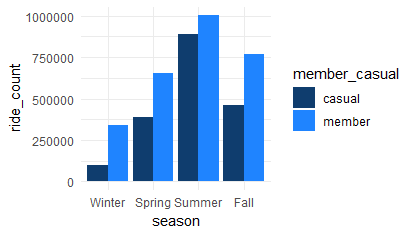
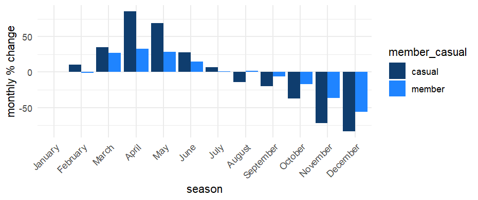
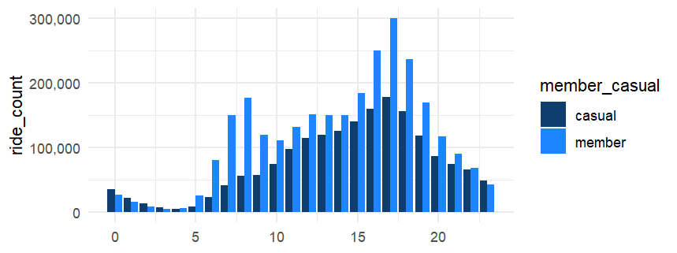
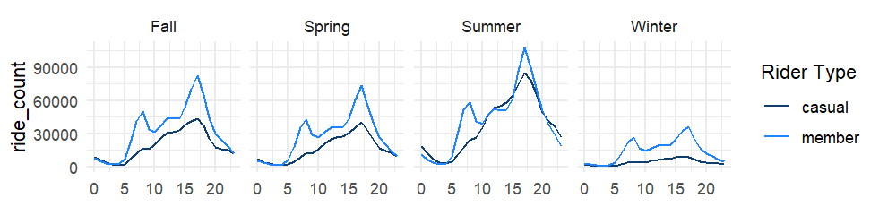
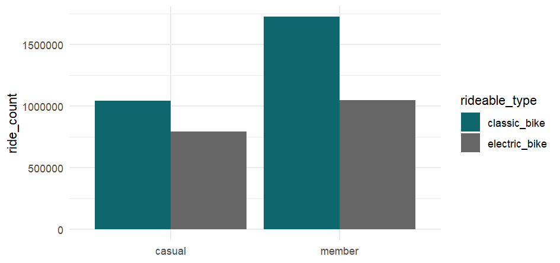
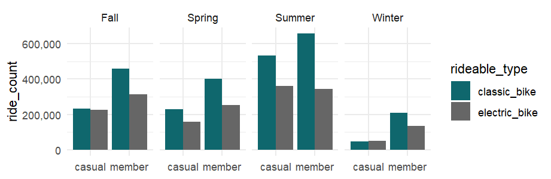

DivvyBikeSharing
======

[Divvy](https://en.wikipedia.org/wiki/Divvy) is a bike sharing system in
Chicago recently acquired and owned by Lyft, Inc.  

*Management Decision Problem (MDP):* Let’s convert casual riders to members

*The Market research question (MRQ):* How do they each use Divvy?

We'll be using 12 months of ride data (MAY 2022 - APR 2023) published [here](https://divvybikes.com/system-data).  

  
-------
### Cleaning  
All cleaning was done in BigQuery SQL.

 *__NOTE__ Only more complex queries are displayed here. For the rest, please see [here](link).*  


Some basic things that I did are:

|  Operation | Why  |
|---|---|
| 1. Duplicate check  |   |
| 2. Docked bikes were converted to Classic | [Someone said](https://medium.com/@iainselliott/google-data-analytics-capstone-project-cyclistic-case-study-8baed2f5a286) that classic and docked bikes are the same so I pretended that my hypothetical boss confirmed this and converted all to classic.  |
| 3. Rides with irrelevant stations were removed  | The same person had a [list](https://github.com/iainelli/Capstone-Project-Cyclistic-Case-Study/blob/main/data_cleaning_analysis.sql)  of stations that were service stations for the bikes and not public. I checked the rows with these and the amount of missing data in those rows convinced me that this was true; again, in real life I would confirm with my boss, which I will pretend I did for now.    |
|4. Ride length was computed from the timestamps|For calculations|
|  5. Rides under 1 minute and over 24 hours were removed | Rides start from 1 minute, and anything longer than 24 is considered stolen or missing. <br/> If anyonne cancelled their rides in less than one minute, it doesn't add any value to our research of ride trends. If we wish to explore the cancel rates then we can do that later. <br/> Missing bike trends may also be addressed in future projects|
| 6. Missing station names and ids were filled using self joins based off of latitude and longitude data |  |
| 7. The two remainders from 6 were investigated and left as is | There was an [event](https://blockclubchicago.org/2022/07/14/the-silver-room-block-party-is-back-this-weekend-heres-how-to-go-in-style/) during the dates when Oakwood Beach Valet are recorded, and there was a [house sale](https://www.redfin.com/IL/Chicago/2437-W-Cortez-St-60622/unit-1/home/18914666) during the dates that 410 was recorded. |
| 8. Duplicates created in the process were removed. | Operation 6 created duplicates from using LEFT JOIN with un-unique lat_lng values |
| 9. Electric bikes with no start_station_name were inserted with "bike_lock" | We have already removed stolen bikes and checked for starting latitude and longitude, we will assume that electric bikes with no start station are parked using the preinstalled lock. |
| 10. Top 10 common routes were made from approximate lat/lng | This is for a flow map in Power BI. I rounded the latitude and longitude to the 4th decimal place so that it covers a radius of approx. 8m |
| 11. Separate date columns were added | Power BI couldn't handle the amount of data to do this and a separate date table proved itself useless for the same reason. |
| 12. Medians were calculated (per hour, day, month, season) | Power BI couldn't handle the amount of data to do this. |
| 13. Monthly % change was calcualted (count, median and total ride length) | Power BI couldn't handle the amount of data to do this. |


Some operations worth showing are:  
#### Operation 6 
```sql
---make a reference for JOIN using lat and lng
CREATE OR REPLACE TABLE `japanese-grammar-276308.divvy_project_mana.cyclistic_combined` AS
SELECT *,
       CONCAT(CAST(start_lat AS STRING), ', ', CAST(start_lng AS STRING)) AS start_lat_lng
FROM `japanese-grammar-276308.divvy_project_mana.cyclistic_combined`;


---Self joining to fill in empty start_station_name where lat/lng are exact matches
CREATE OR REPLACE TABLE `japanese-grammar-276308.divvy_project_mana.cyclistic_combined` AS
  SELECT
     t1.*, IF(t1.start_station_name IS NULL, t2.start_station_name, t1.start_station_name) AS start_station_name_v1
  FROM 
    `japanese-grammar-276308.divvy_project_mana.cyclistic_combined` AS t1
  LEFT JOIN
    (
      SELECT
        DISTINCT start_station_name, start_lat_lng
      FROM
        `japanese-grammar-276308.divvy_project_mana.cyclistic_combined`
      WHERE
        start_station_name IS NOT NULL AND start_lat_lng IS NOT NULL
    ) AS t2
      ON
        t1.start_lat_lng = t2.start_lat_lng;
```
#### Operation 7  
```sql
---START STATION check for remaining nulls
SELECT *
FROM (
  SELECT 
    started_at, 
    ended_at, 
    start_station_name_v1,
    start_station_id_v1, 
    start_lat_lng,
    ROW_NUMBER() OVER (PARTITION BY start_station_name_v1 ORDER BY started_at) AS row_num
  FROM `japanese-grammar-276308.divvy_project_mana.cyclistic_combined` 
  WHERE
    start_lat_lng IS NOT NULL AND
    start_station_name_v1 = start_station_id_v1
) 
;
---410 and Oakwood Beach are from specific dates
---Oakwood is an event, 410 is unknown
---find the ids
SELECT
  DISTINCT start_station_id
FROM
  `japanese-grammar-276308.divvy_project_mana.cyclistic_combined`
WHERE
  start_station_name = 'Divvy Valet - Oakwood Beach' OR start_station_name = '410';
---looks like they don't exist so leave as is unless necessary
```  
#### Operation 10  

```sql
---making a table with top 10 of each member type
---casuals
CREATE OR REPLACE TABLE `japanese-grammar-276308.divvy_project_mana.member_route_all` AS
SELECT member_casual, start_lat_lng_round, end_lat_lng_round, COUNT(*) AS num_occurrences
FROM `japanese-grammar-276308.divvy_project_mana.rides_view`
WHERE member_casual = 'casual'
GROUP BY member_casual, start_lat_lng_round, end_lat_lng_round
ORDER BY num_occurrences DESC
LIMIT 10;

---members
CREATE OR REPLACE VIEW `japanese-grammar-276308.divvy_project_mana.common_route_member` AS
SELECT member_casual, start_lat_lng_round, end_lat_lng_round, COUNT(*) AS num_occurrences
FROM `japanese-grammar-276308.divvy_project_mana.rides_view`
WHERE member_casual = 'member'
GROUP BY member_casual, start_lat_lng_round, end_lat_lng_round
ORDER BY num_occurrences DESC
LIMIT 10;
---combine them
INSERT INTO `japanese-grammar-276308.divvy_project_mana.member_route_all`
SELECT * FROM `japanese-grammar-276308.divvy_project_mana.common_route_member`;
---add column for start_station_name_v1
ALTER TABLE `japanese-grammar-276308.divvy_project_mana.member_route_all`
ADD COLUMN
  start_station_name_v1 STRING;

---insert most likely start_station_name_v1
---make view of distinct start_station_name_v1 and order by count

CREATE OR REPLACE VIEW `japanese-grammar-276308.divvy_project_mana.first_appearance` AS
SELECT
  start_station_name_v1, start_lat_lng_round, count
FROM
  (
    SELECT
      start_station_name_v1, start_lat_lng_round, count,
        ROW_NUMBER() OVER (PARTITION BY start_lat_lng_round ORDER BY count DESC) AS row_number
    FROM
      (
        SELECT
          start_station_name_v1, start_lat_lng_round, COUNT(*) AS count
        FROM
          `japanese-grammar-276308.divvy_project_mana.rides_view`
        GROUP BY start_station_name_v1, start_lat_lng_round
      )
  )

WHERE
  row_number = 1
ORDER BY count DESC;
```
#### Operation 14  
```sql
---ln(B) - ln(A)....(percentage change per date)

---ride count
CREATE OR REPLACE TABLE `japanese-grammar-276308.divvy_project_mana.cyclistic_combined` AS
SELECT 
  Table1.*,
  Table2.monthly_count_change
FROM 
`japanese-grammar-276308.divvy_project_mana.cyclistic_combined` AS Table1
FULL OUTER JOIN 
  (SELECT member_casual, monthly_count_change, started_at_month
FROM 
(
SELECT
 started_at_month, member_casual,
(LN(ride_count) - LN(LAG(ride_count, 1) OVER (PARTITION BY member_casual ORDER BY started_at_month)))*100 AS monthly_count_change
FROM
(
SELECT  started_at_month, member_casual, COUNT(ride_id) AS ride_count
FROM `japanese-grammar-276308.divvy_project_mana.cyclistic_combined`

GROUP BY  started_at_month, member_casual
)
ORDER BY started_at_month
)) AS Table2 
ON 
  Table1.member_casual = Table2.member_casual AND 
  Table1.started_at_month = Table2.started_at_month
ORDER BY member_casual;
```
### Analysis  
This was done in R, and later summarised into a visualisation report in Power BI (Using Tableau would have saved me hours but learners make mistakes)  
<br/>  
I first loaded the data straight from BigQuery and saved it to avoid being charged everytime.  
```r
#connecting to bigquery to pull the data

library(bigrquery)
library(dplyr)
df <- dbConnect(
  bigquery(),
  project =  "japanese-grammar-276308",
  dataset = "divvy_project_mana",
  billing = "japanese-grammar-276308"
)

#checking if we got the tables
dbListTables(df)

#some more testing...
main_df <- tbl(df, "cyclistic_combined")

glimpse(main_df)

#looks ok so I'll download the data into R
main_df <- collect(main_df)
#Save data in folder
write.csv(main_df, file = "C:\\Users\\Mana\\OneDrive\\Documents\\R\\cyclistic\\Data_R\\cleaned_data.csv")
```  
Let's check the no. of rides per season  
    
We see that:
* members ride more overall
* Both increase towards summer then decline
* Large gap in winter
* Small gap in summer
</br>


Let's check the monthly change  
  
We see that:  
* casuals' monthly consumption is far more elastic
* members' monthly consumption is relatively stable with some slight ups and downs during summer and winter as we would expect
</br>

Next is daily trends  
  
We see that:  
* casuals ride more on weekends than weekdays
* members ride a lot during the week *likely for work?*
* casuals ride more than members on weekends during summer
* ride patterns don't seem to largely change otherwise
</br>

Hourly trends  
   
We see that:  
* casuals seem to ride more towards the end of the working day *for leisure and going home?*
* It's fairly safe to assume that our guess was right; many members ride to and from work
* casuals seem to ride far less during the winter *depending on membership cancellation rates, this is something significant that we may fix by converting them to members....?*
* hourly ride patterns don't seem to largely change for members
</br>

Bike type  
   
We see that:  
* Both prefer classic bikes over electric bikes
* casuals seem to have a slighly more equal preference between the types than members
* Casuals also rode slightly more electric bikes during [winter](images/count_type_season_plot.png) and during [early morning hours](images/count_type_hour_morning.png)
</br>

Until now, we've been looking at ride frequency, but what about each ride's length?  
</br>  
